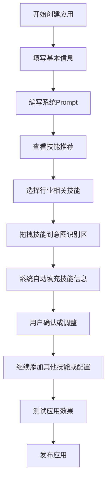

# 功能编排创建优化 PRD

## 1. 项目背景

### 1.1 现状分析
当前百宝箱企业版的功能编排创建功能已经具备了完整的业务流程：
- **前置判断**：用户身份验证、权限检查等业务判断逻辑
- **快速决策**：预配置的FAQ信息，提升固定问答的准确率和速度
- **意图识别**：核心能力模块，根据用户输入自动判断意图并调用对应技能

### 1.2 优化需求
为提升用户体验和操作效率，需要在现有功能基础上增加两个核心功能：
1. **系统Prompt智能填写**：自动生成与手动修正相结合
2. **技能推荐系统**：基于行业分类的技能库，支持拖拽操作

## 2. 产品目标

### 2.1 用户体验目标
- 降低功能编排创建的学习成本和操作复杂度
- 提升配置效率，减少用户重复性操作
- 增强智能化程度，提供个性化的技能推荐

### 2.2 业务目标
- 提高功能编排应用的创建成功率
- 增加用户对平台技能库的使用率
- 优化整体应用质量和标准化程度

## 3. 功能需求详述

### 3.1 系统Prompt配置

#### 3.1.1 功能描述
在功能编排创建界面的左侧增加"系统Prompt"配置区域，提供简洁直观的Prompt编辑功能。系统Prompt作为智能体的核心指令，将全局影响整个智能体的运行效果和行为表现。

#### 3.1.2 核心特性

**空白状态设计**
- 默认为空白的编辑区域，不进行任何自动填充
- 给用户最大的自由度来定义智能体的角色和行为
- 避免系统预设内容对用户创意的干扰

**智能提示引导**
- 提供灰色占位文案，引导用户填写关键内容
- 占位文案包含最佳实践建议和常见配置项提醒
- 帮助新手用户理解Prompt的作用和填写要点

**完全手动控制**
- 所有Prompt内容均由用户手动填写和维护
- 用户对智能体行为拥有完全的控制权
- 确保Prompt与用户实际需求完全匹配

#### 3.1.3 界面设计要求

**布局位置**
- 位于创建界面左侧，独立的配置面板
- 与整体视图并列显示，便于用户随时编辑和查看

**编辑体验**
- 提供纯文本编辑器，支持多行输入
- 空白状态显示引导性占位文案
- 字符计数显示，建议控制在1000-2000字符内

**占位文案内容**
```
在此设置您的智能体角色定位和行为准则...

建议包含以下要素：
• 智能体的身份角色（如：专业客服助手、旅游规划师等）
• 服务领域和专业能力范围
• 与用户交互的语言风格和态度
• 处理问题的基本原则和注意事项
• 无法处理情况下的应对方式

示例：
您是一个专业的旅游规划助手，具备丰富的旅游知识和规划经验。您应当以友好、专业的态度为用户提供准确的旅游信息和建议。在无法确定答案时，请如实告知并建议用户咨询相关部门。
```

**视觉设计**
- 占位文案使用浅灰色（#9CA3AF）显示
- 编辑状态下占位文案自动消失
- 提供"清空"和"示例模板"快捷操作按钮

#### 3.1.4 技术实现要点

**简洁的存储结构**
```json
{
  "systemPrompt": "用户输入的完整Prompt内容",
  "lastModified": "2024-09-09T10:30:00Z",
  "characterCount": 1205
}
```

**用户体验优化**
- 实时字符计数，避免内容过长影响API调用
- 自动保存草稿，防止内容丢失
- 支持Ctrl+Z撤销操作

**最佳实践提示**
- 在编辑区域下方提供"编写提示"折叠面板
- 包含Prompt编写的最佳实践和常见问题
- 提供不同行业的Prompt模板参考

### 3.2 技能推荐系统

#### 3.2.1 功能描述
在左侧新增"技能推荐"面板，展示分行业的常用技能库，支持拖拽添加到意图识别功能区。

#### 3.2.2 核心特性

**行业分类技能库**
- 按行业维度组织技能：旅游、电商、教育、金融、医疗、客服等
- 每个行业下展示该行业最常用的技能列表
- 支持跨行业技能共享和推荐

**智能推荐算法**
- 基于当前应用所属行业优先推荐相关技能
- 根据已添加的技能推荐互补技能
- 考虑技能使用频率和成功率进行排序

**拖拽交互体验**
- 支持从技能推荐面板直接拖拽到意图识别区域
- 提供拖拽预览效果和放置区域高亮
- 支持批量选择和批量添加

#### 3.2.3 界面设计要求

**布局结构**
```
技能推荐面板
├── 行业选择标签
├── 推荐技能列表
│   ├── 技能卡片
│   │   ├── 技能名称
│   │   ├── 技能描述
│   │   ├── 使用场景标签
│   │   └── 拖拽手柄
│   └── 加载更多
└── 搜索筛选
```

**视觉设计**
- 技能卡片采用简洁的卡片式设计
- 支持拖拽时的视觉反馈（阴影、缩放等）
- 已添加技能的置灰处理

**交互流程**
1. 用户选择行业标签或使用搜索
2. 浏览推荐的技能列表
3. 拖拽技能卡片到意图识别区域
4. 系统自动打开技能配置弹窗
5. 预填充技能相关信息

#### 3.2.4 技能信息预填充

**自动填充字段**
- **技能名称**：使用推荐技能的标准名称
- **调用场景描述**：基于技能模板生成标准描述
- **标签**：自动添加行业和功能相关标签
- **调用技能**：自动选择对应的插件

**个性化调整**
- 根据当前应用上下文调整描述内容
- 结合已有技能避免功能重复
- 提供修改建议和最佳实践提示

### 3.3 技能库数据结构

#### 3.3.1 技能模板定义
```json
{
  "skillId": "travel_attraction_query",
  "name": "景点查询",
  "category": "旅游",
  "description": "查询旅游景点信息，包括门票价格、开放时间、交通路线等",
  "scenarios": [
    "用户询问某个景点的详细信息",
    "用户需要了解景点门票价格",
    "用户咨询景点开放时间"
  ],
  "tags": ["景点", "查询", "旅游信息"],
  "pluginId": "attraction_info_plugin",
  "usageFrequency": 85,
  "successRate": 92,
  "promptTemplate": "当用户询问景点信息时，调用此技能获取详细的景点数据...",
  "parameterTemplate": {
    "location": "{{用户输入的地点名称}}",
    "infoType": "{{信息类型：基本信息|门票价格|开放时间}}"
  }
}
```

#### 3.3.2 行业技能映射
- **旅游行业**：景点查询、酒店预订、路线规划、天气查询
- **电商行业**：商品搜索、订单查询、物流跟踪、售后服务
- **教育行业**：课程查询、成绩查询、作业提交、学习资料
- **客服行业**：工单创建、问题分类、知识库检索、满意度调研

## 4. 用户体验流程

### 4.1 创建应用完整流程



### 4.2 关键交互节点

**Prompt编辑节点**
- 用户可专注于编写高质量的系统Prompt
- 提供Prompt编写最佳实践指导
- 支持模板参考和示例查看

**技能推荐节点** 
- 智能高亮最相关的技能
- 提供技能组合推荐（常用技能套装）
- 显示技能使用统计和用户评价

**拖拽操作节点**
- 清晰的拖拽区域指示
- 实时的放置预览效果
- 操作失败时的友好提示

